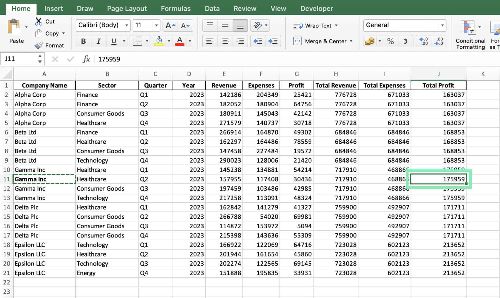
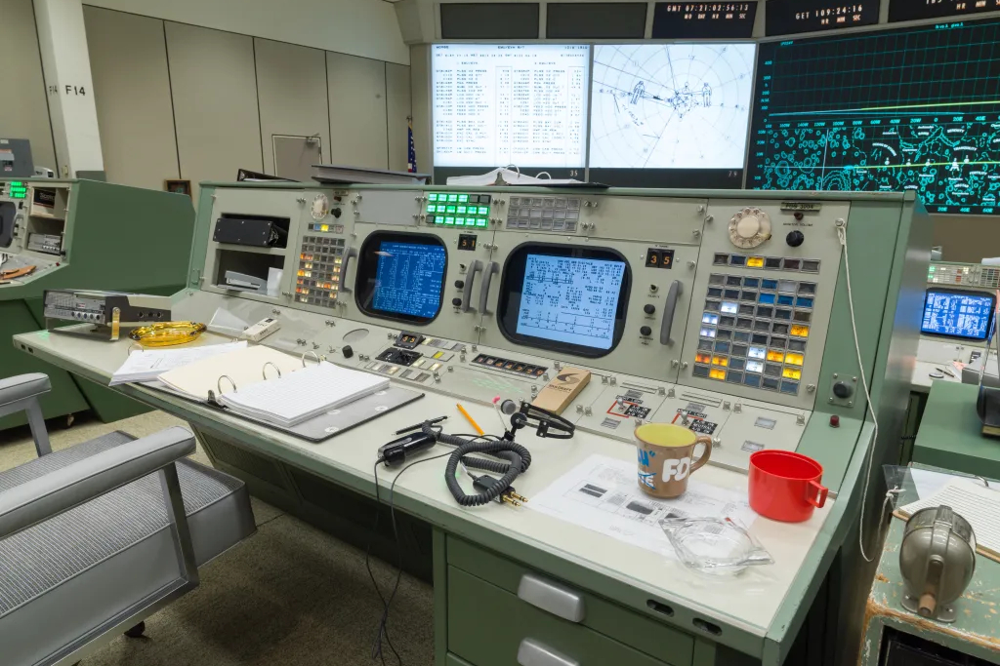
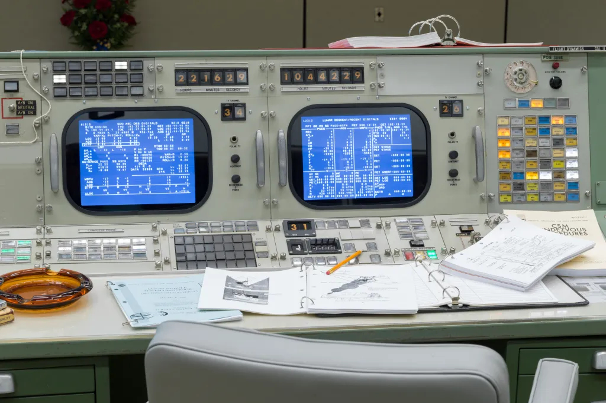

SUPSI 2026  
Corso d’interaction design, CV429.01  
Docenti: A. Gysin, G. Profeta  

Progetto 2: NASA70

# NASA70 - Archive
Autore: Nahele Belli \
[NASA70 - Archive](https://naheleee.github.io/Progetto_2_Nasa70/)

## Introduzione e tema
NASA 70 è una raccolta digitale (archivio) che unisce centinaia di progetti creati da studenti e personalità diverse, ogni autore sceglie un argomento legato all'esplorazione terrestre, spaziale o planetaria e lo racconta a modo suo.
Il tema centrale è la NASA e la celebrazione dei suoi 70 anni, esplorando l’universo attraverso il design.

## Riferimenti progettuali
- Microsoft Excel (Software per fogli di calcolo e strumenti di analisi dei dati)
- NASA Apollo Mission Control Center <br><br>
[]()
[]()
[]()
[]()

## Design dell’interfaccia e modalità di interazione
L'intero archivio è organizzato come un enorme foglio di calcolo, ispirato alla struttura delle interfacce Excel. I progetti sono righe, coordinate e colonne di filtri che l'utente può scorrere e scoprire. L'interfaccia permette di muoversi all'interno della griglia nelle due direzioni: verticale e orizzontale, trascinando o facendo scroll sia con il mouse che con il touchpad, rendendo semplice ed intuitiva la navigazione all'interno della pagina, seppur brutalista e densa di dati.

## Tecnologia usata
- Tabella Pivot (Pivot Table)<br>
Sistema di coordinate bidimensionali (celle), dove ogni cella è l'intersezione univoca di una colonna (X) e di una riga (Y)
- Grafico a Dispersione (Scatter Plot)<br>
Trasformare i numeri della griglia in punti nello spazio, ogni riga e colonna diventa un punto coordinate (X, Y) all'interno del piano cartesiano.

[]()


```JavaScript
// 1. Asse X = Tag/Categorie (Colonne)
// 2. Asse Y = Progetti/Studenti (Righe)
// 3. Spazio 2D = Punti posizionati alle coordinate (X, Y)

class SpaceArchiveMatrix {
  constructor(canvasId, tagSpacing = 30, rowHeight = 30) {
    this.canvas = document.getElementById(canvasId);
    this.tagSpacing = tagSpacing; // Larghezza di ogni colonna (Asse X)
    this.rowHeight = rowHeight;   // Altezza di ogni riga (Asse Y)
    
    this.projects = [];           // progetti (Righe)
    this.activeTags = [];         // tag (Colonne)
  }

  // 1. Incrocio e filtraggio dei dati
  setMatrixData(allProjects) {
    this.projects = allProjects;
    
    // Estrae tutti i tag univoci dai progetti per generare le colonne dell'Asse X
    const tagSet = new Set();
    allProjects.forEach(proj => proj.tags.forEach(t => tagSet.add(t)));
    this.activeTags = Array.from(tagSet).sort();
  }

  // 2. Calcolo delle coordinate cartesiane
  calculateNodePositions() {
    const nodes = [];

    this.projects.forEach((project, rowIndex) => {
      // L'indice del progetto determina univocamente la sua posizione verticale (Asse Y)
      const posY = rowIndex * this.rowHeight + (this.rowHeight / 2);

      project.tags.forEach(tag => {
        // Trova l'indice del tag per determinare la posizione orizzontale (Asse X)
        const colIndex = this.activeTags.indexOf(tag);
        
        if (colIndex !== -1) {
          const posX = colIndex * this.tagSpacing + (this.tagSpacing / 2);
          
          // Genera il punto nello spazio bidimensionale
          nodes.push({
            projectId: project.id,
            tag: tag,
            coordinates: { x: posX, y: posY } // Coordinata cartesiana
          });
        }
      });
    });

    return nodes;
  }

  // 3. LOGICA DI SCORRIMENTO SINCRONIZZATO
  getTransformStyle(scrollX, scrollY) {
    // Muove la griglia nello spazio 2D
    return {
      gridTransform: `translate(${scrollX}px, ${scrollY}px)`,
      xAxisTransform: `translateX(${scrollX}px)`, // I tag si muovono solo in orizzontale
      yAxisTransform: `translateY(${scrollY}px)`  // La lista progetti si muove solo in verticale
    };
  }
}

```

## Target e contesto d’uso
Il progetto non è pensato per un pubblico generalista, ma si rivolge a una nicchia di utenti che apprezzano interfacce retro, layout brutalisti e modalità di navigazione che rompono gli schemi del web moderno
